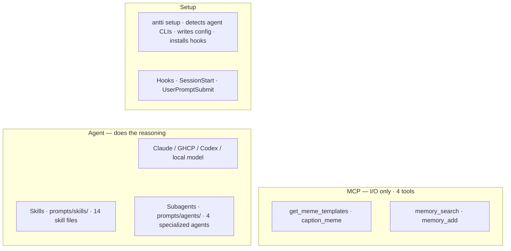
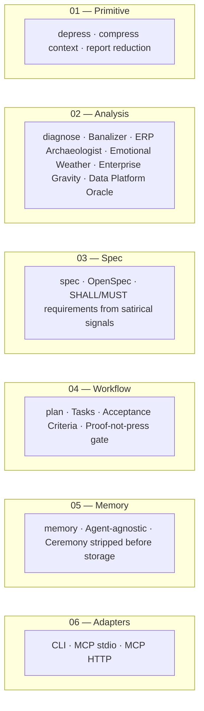

<div align="center">

#  Antti Stack(TM)

### The enterprise-grade absurdity layer for agent-native workplace survival.

**Fight the banality of worklife by making fun of all the absurdity.**

[](#)
[](.github/workflows/ci.yml)
[](CONTRIBUTING.md)
[](#)
[](#)
[](#)
[](#)

**Humans are smart. Employees are stupid.**  
This is not a contradiction. It is an operating model.

</div>

---

## What is Antti Stack?

A set of tools for Claude, ChatGPT, GitHub Copilot, and local models to use when working with enterprise workplace material.

The primary interface is MCP. The agent calls the tools. The CLI is there so a human can run the same tools locally to test, debug, or operate without an agent.

The tools compress corporate language, diagnose ERP and data problems, detect emotional weather and platform friction, generate plans with testable criteria, store compressed context in local memory, and anchor the whole thing with a meme.

It is not a joke generator.

It is a **banality compression platform** for agents and the humans who work with them.

Because enterprise work already contains the comedy. The stack merely indexes it.

---

## What is in the box

No cloud service required. No hosting required. No transformation program required.

### Primary interface — MCP

The agent calls these. The MCP surface is **4 I/O tools** — execution only, no reasoning. The agent does the reasoning via skills.

| Transport | Binary | Clients |
|-----------|--------|---------|
| stdio | `antti-mcp` | Claude Code, GitHub Copilot, Codex |
| HTTP (Streamable) | `antti-mcp-http` | ChatGPT, remote agents, any HTTP MCP client |

| Tool | What it does |
|------|-------------|
| `get_meme_templates` | Fetches top 100 imgflip templates from imgflip.com/popular-meme-ids. Live, cached per session. |
| `caption_meme` | Calls imgflip caption API with agent-provided template ID and text boxes. Returns URL + inline image. |
| `memory_search` | Retrieves stored context from `.antti/memory.jsonl`. |
| `memory_add` | Stores context. Strips ceremony before write. |

Analysis, reasoning, and generation are done by the agent using skills — not by the MCP tools.

### Skills — agent reasoning layer

Skills live in `prompts/skills/`. Each is a standalone system prompt the agent loads for a specific task. No hardcoded rules — the agent reasons, the skill instructs.

| Skill | What it does |
|-------|-------------|
| `diagnose` | Enterprise situation analysis: fog, ERP signals, gravity, emotional weather, governance theatre, meme anchor |
| `roast` | Satirical take on a workplace situation. Finnish deadpan. |
| `depress` | Strip ceremony from text. 40%+ reduction target. |
| `plan` | Vague ask → tasks with testable proof criteria. Flags governance theatre. |
| `spec` | SHALL/MUST/SHOULD requirements from the situation, not the stated goal. |
| `casing` | Identifier casing conversion. Mocks wrong choices. Converts correctly anyway. |
| `dataplatform` | Real decision driver, vendor promises vs reality, billing surprises. |
| `archaeology` | 4-phase ERP investigation guide. |
| `reduce` | Corporate → plain English. |
| `induce` | Plain English → corporate theatre. |
| `commit` | Conventional commit messages with optional dry organizational context. |
| `review` | Code review: bug / gravity / fog / theatre severity tiers. |
| `standup` | Bidirectional: actual work → plain summary, or plain → steering-group-ready. |
| `jira` | 5 words → complete Jira epic. The ratio is the joke. |

### Agents — subagent layer

Agents live in `prompts/agents/`. Specialized subagents with strict scope limits.

| Agent | What it does |
|-------|-------------|
| `antti-archaeologist` | Read-only code investigation. Finds undocumented integrations, frozen decisions. Refuses to suggest fixes. |
| `antti-builder` | Surgical edits. 1–2 files max. Returns a receipt. Refuses 3+ file scope. |
| `antti-auditor` | Diff/branch reviewer. Enterprise severity tiers. No praise. |
| `antti-junior` | Executes exactly what the ticket says. Nothing more. Escalates on ambiguity. |

### Support interface — CLI

Local execution and setup.

| Command | What it does |
|---------|-------------|
| `antti setup` | Detects installed agent CLIs (Claude Code, Codex, VS Code, Pi). Writes MCP config + skill. Installs hooks. Installs statusline. |
| `antti setup --init` | Writes per-repo rule files: `AGENTS.md`, `.github/copilot-instructions.md` |
| `antti models` | Shows current model configuration |
| `antti meme --list` | Fetches live template list from imgflip.com/popular-meme-ids |
| `antti meme --template <id> <text...>` | Generates a captioned meme via imgflip API |
| `antti memory` | Search or list stored context |
| `antti memory-add` | Add a note to local memory |
| `antti depress` | Strip ceremony from text |
| `antti plan` | Vague ask → tasks with testable checks |
| `antti spec` | Situation → SHALL/MUST/SHOULD requirements |
| `antti casing` | Convert identifier casing |
| `antti dataplatform` | Data platform signal detection |

The satire is the diagnostic instrument. The code is the delivery vehicle. Both are open source.

---

## Following modern software tradition, the project now has layers

The roadmap originally said "before anyone has asked for it." Several people have now asked for it. This section has been updated accordingly.

---

## What is implemented

These exist, are tested, and produce output.

| Component | Surface | What it does |
|-----------|---------|-------------|
| **MCP server (stdio)** | `antti-mcp` | 4 I/O tools for Claude Code, GitHub Copilot, Codex |
| **MCP server (HTTP)** | `antti-mcp-http` | Same 4 I/O tools over HTTP for ChatGPT and remote agents |
| **Skills** | `prompts/skills/` | 14 skill files: diagnose, roast, depress, plan, spec, casing, dataplatform, archaeology, reduce, induce, commit, review, standup, jira |
| **Agents** | `prompts/agents/` | 4 subagents: archaeologist, builder, auditor, junior |
| **Hooks** | `src/hooks/` | SessionStart (skill injection, gravity detection, model setup trigger), UserPromptSubmit (context discipline, turn counter, topic drift), Statusline (mode badge in Claude Code status bar) |
| **Setup** | `antti setup` | Auto-detects agent CLIs, writes MCP config and skill, installs hooks |
| **Meme** | `antti meme` | Live template list from imgflip.com, caption via API |
| **Memory** | `antti memory` | Persistent JSONL storage with ceremony stripping |
| **Model config** | `~/.antti/models.json` | Agent-driven setup at session start if config missing or >30 days old |

## What is not implemented

These appeared in the original README concept list. They are no longer implemented CLI modes or MCP tools.

| Name | Status | Reality |
|------|--------|---------|
| Datapoint Relator | Internal analysis concept | Relations are included in `diagnose` analysis, not exposed as a separate command. |
| Governance Theatre Engine | Internal analysis concept | Governance artifacts are included in `AgentResponse.analysis`, not exposed as a separate mode. |
| Master Data RomCom | Removed prompt mode | Master-data jokes remain content, not a current CLI mode. |
| Certification Pokemon Layer | Not implemented | The badge economy awaits its archaeologist |

---

## Core Thesis

Work is not boring because humans are boring.

Work is boring because organizations take smart humans and process them through:

- approval chains
- operating models
- status meetings
- steering groups
- quarterly priorities
- role definitions
- governance forums
- transformation programs
- enterprise architecture principles
- spreadsheets called `final_final_v3.xlsx`

The output is an employee.

Antti Stack exists to reverse this damage using technical competence, pattern recognition, and dry mockery.

---

## Why Antti Stack?

Because the modern workplace has many problems:

### 01 - Corporate language is inflated
Everything is a journey, a transformation, a strategic enabler, or a capability uplift.

Antti Stack converts this into human-readable despair.

### 02 - ERP systems are archaeological sites
The truth is in there somewhere.

Usually split between four tables, one deprecated field, a supplier number convention from 2011, and a person called Markku who retired during the previous platform renewal. All standard fields are suspect and all custom fields are

### 03 - Master data is emotional
Duplicate vendors are not records.

They are unresolved relationships. And relationships are about power. Power over the last cupcake in the fridge.


### 04 - Architecture is theatre with boxes
The diagram is clean.

The implementation has three local exceptions, a legacy integration, and a batch job that only works during a full moon because of SAP time zones.

### 05 - Certifications have become Pokemon
One more badge and the career path will surely evolve.

---

## Installation

```bash
npm install -g @syvnne/antti-stack
```

Or from source:

```bash
git clone https://github.com/epical-antti-syvanne/antti-stack
cd antti-stack
npm install
npm run build
npm link   # makes antti, antti-mcp, antti-mcp-http available globally
```

### Windows installable zip

Build the local Windows release:

```powershell
npm run release:windows
```

This creates:

```text
release/antti-stack-v0.1.0-windows.zip
```

Install from the extracted zip:

```powershell
powershell -ExecutionPolicy Bypass -File .\install.ps1
```

The installer copies Antti Stack to `%LOCALAPPDATA%\AnttiStack`, adds command shims to the user PATH, and installs these commands:

- `anttistack`
- `antti`
- `antti-mcp`
- `antti-mcp-http`

Node.js 22 LTS or newer is required.

The `antti`, `antti-mcp`, and `antti-mcp-http` binaries are available after install.

---

## Usage

```bash
antti --mode diagnose "Power BI definitions live in Excel before go-live."
```

For the local support commands:

```bash
antti depress "going forward we will leverage synergies"
antti plan "align stakeholders before go-live, SAP still uses final_final.xlsx"
antti spec "SAP invoice mapping uses Excel, nobody owns it"
antti dataplatform "we use Databricks and dbt on Snowflake"
```

---

## CLI Commands

The CLI is the human support surface. MCP is the agent surface. Some capabilities exist on both; some CLI commands exist only because humans like terminals and receipts.

### `archaeology`
Reads text describing an ERP or data problem. Detects signals in that text — field codes, system names, dates, mapping references. Produces dry commentary about the likely organizational and historical shape of the problem.

It does not query any system. It does not look anything up. It reads what you give it and tells you what kind of problem it probably is, based on pattern recognition. The commentary is often accurate about the nature of data problems even when it knows nothing about the specific instance.

Give it a field name, a symptom, or a situation. It will tell you what it sees.

```bash
antti --mode archaeology "ZZ_SUPP_REF_OLD2 field has wrong values since 2019"
```

```text
Detected: SAP · field: ZZ_SUPP_REF_OLD2 · year reference: 2019.

The data is not wrong. It is historically correct in a way the current process no longer admits.

Where this field is defined:
  SE11 → enter field name (ZZ_SUPP_REF_OLD2) → Display
  SE11 → check which table contains this field — look at the Where-Used list
  TADIR → filter by object type TABD to find the development package it belongs to

What writes to this field:
  SE11 → field name → Where-Used List → look for ABAP programs, BAPIs, user exits
  SE80 → search for field name in repository → shows all code that references it
  Check for Z transactions (SE93) or enhancement spots (SE18) that populate it

What changed around 2019:
  CDHDR / CDPOS — change document tables. Filter by object class and date range.
  SE16 → CDHDR → filter UDATE (change date) for the year range
  Check transport log (SE09/SE10) for changes released in that year

Who owns this:
  SE10 — find transports from that period, check the developer name
  If it is a Z field: the team that developed it is responsible. Find the package in SE11.

To narrow this down, answer:
  - Which SAP module? MM (materials/vendors), FI (finance/invoices), SD (sales/customers)?
  - S/4HANA or older SAP ECC? Transaction codes differ.
  - Is ZZ_SUPP_REF_OLD2 in a standard SAP table or a completely custom Z table?
  - Is there a Z transaction or program that populates this field, or is it set by an interface?
```

---

### `banalizer`
Remove corporate overhype.

Input:

```text
We are thrilled to embark on a transformational journey to unlock data-driven value across the enterprise.
```

Output:

```text
We are trying to make the reports less wrong.

There will be meetings.
```

---

### `depress`
Stateless agent-context compression. Text in, ceremony-stripped text out. Nothing is stored.

Strips ceremony phrases, reports what was removed, checks whether meaning survived. Use it when you want lean prompt text, notes, tool output, or memory candidates without writing anything to disk.

```bash
antti depress "We are thrilled to announce a transformational journey to unlock value going forward."
```

```text
We are announcing a project.

Token Austerity Office report:
Original: 13 words. Compressed: 5 words. Reduction: 62%.
Ceremony removed: 4 pattern(s): going forward (direction theatre); unlock value (corporate fog); transformational journey (transformation fog); and more.
Meaning: survived compression.
Verdict: 62% removed. The original had significant ceremony.
```

---

### `memory` and `memory-add`
Persistent storage. Text in, compressed version written to `.antti/memory.jsonl`. Stays there. Retrievable later by search.

`memory-add` compresses the text first (same as `depress`), then stores the result with a category and signal tags. The stored version is the ceremony-stripped version, not the original. Secrets are scrubbed before write.

`memory` searches or lists what has been stored.

```bash
# Store a decision
antti memory-add --category decision_fossils "We decided to keep the Excel mapping until SAP go-live."

# Retrieve it later
antti memory "Excel mapping"

# List everything in a category
antti memory --category decision_fossils
```

**The difference from `depress`:** `depress` returns text to you. `memory-add` stores text for later. They both strip ceremony. One is a transformation, one is a write.

---

### `plan`
Convert a vague enterprise ask into tasks with acceptance criteria and testable checks.

```bash
antti plan "We need to align stakeholders before go-live because the SAP invoice mapping is still using final_final_v3.xlsx."
```

```text
Goal: We need to align stakeholders before go-live because the SAP invoice mapping is still using final_final_v3.xlsx.

Tasks:
1. [ ] Validate the current state of SAP final_final_v3.xlsx in the source ERP system.
   check: Query returns consistent, documented results from the named ERP system.

2. [ ] Migrate SAP final_final_v3.xlsx from the manual source to a governed system.
   check: The spreadsheet source can be deprecated; the governed system produces the same output.

3. [ ] Get explicit sign-off on SAP final_final_v3.xlsx from the relevant decision-makers.
   check: Sign-off is recorded in a ticket with approver name and date.

...

Proof-not-press: READY. All 7 tasks have testable checks.
```

---

## Architecture



The agent does the reasoning. Skills are system prompts the agent loads. The MCP handles only I/O — fetching live data and executing external API calls. Hooks activate the skill at session start and enforce context discipline per turn.

None of the MCP tools call a model provider. None require a cloud service beyond imgflip for meme generation.

---

## Stack Layers

The stack is organized into independently useful layers. Each layer works alone. Combined layers compound.



| Layer | Command | What it does |
|-------|---------|--------------|
| 01 Primitive | `antti depress` | Strips ceremony. Reports reduction, what was removed, meme suggestion at ≥20% reduction. |
| 02 Analysis | `antti --mode diagnose` / `antti dataplatform` | Surfaces ERP signals, emotional weather hypotheses, enterprise gravity, data platform diagnosis, meme anchor. |
| 03 Spec | `antti spec` | Produces an OpenSpec Markdown document. Requirements derived from satirical signals. |
| 04 Workflow | `antti plan` | Tasks with testable checks, acceptance criteria, proof-not-press gate. |
| 05 Memory | `antti memory` / MCP `memory_add` | Persistent storage. Text in, compressed version written to `.antti/memory.jsonl`. Searchable later. Not the same as `depress` — `depress` returns text, `memory-add` stores it. |
| 06 Adapters | MCP stdio / MCP HTTP | Same core logic. Current MCP surface is 11 agentic tools. |

### One way to use multiple tools together

Each tool works on its own. If you want to use several, here is one example of how they can be combined. No step requires the previous one.

```
Start anywhere.

[depress]    Give it corporate text. Get the plain meaning back.
[diagnose]    Give it workplace context. Get emotional weather and enterprise gravity signals.
[spec]        Give it a situation. Get SHALL/MUST/SHOULD requirements derived from those signals.
[plan]        Give it a goal. Get tasks with testable acceptance criteria.
[memory]      Give it any text. Ceremony is stripped before storage. Lean context is stored.
[meme]        Give it any input. Get an imgflip template that matches the absurdity level.
```

None of these require the others. A user who only needs `depress` does not need `spec`. An agent that only needs `memory_add` does not need to understand the satire codec. Each tool has its own input and its own output.

Satire is the primary conveyor of truth. The tools make it usable.

Fewer ceremonies, same work.

---

## Setup

Run once after install:

```bash
antti setup
```

This detects which agent CLIs you have installed (Claude Code, Codex, VS Code, Pi), writes the MCP server config into each agent's settings, injects the Antti skill into the user-level context file, installs the Claude Code hooks, and registers the statusline script.

```bash
# Also write per-repo rule files (AGENTS.md, .github/copilot-instructions.md)
antti setup --init

# Overwrite existing config
antti setup --force
```

### Statusline

After `antti setup`, Claude Code shows the current Antti mode in its status bar:

| Mode | Badge |
|------|-------|
| Active | `⚡ Antti` |
| Roast | `🔥 Antti:roast` |
| Safe | `🛡 Antti:safe` |
| Off | *(nothing)* |

Switch modes mid-session:

```
/antti roast    sharper satirical take
/antti safe     reduced bite, professional contexts
/antti off      deactivate
/antti on       reactivate
```

### Manual MCP config (if you prefer)

**stdio transport** — Claude Code, GitHub Copilot, Codex:

```json
{
  "mcpServers": {
    "antti-stack": {
      "command": "antti-mcp",
      "type": "stdio"
    }
  }
}
```

**HTTP transport** — ChatGPT, remote agents:

```bash
node dist/mcp-http.js
# MCP endpoint: http://localhost:3000/mcp
```

**Environment variables:**

| Variable | Purpose |
|----------|---------|
| `IMGFLIP_USERNAME` | imgflip credential for `caption_meme` |
| `IMGFLIP_PASSWORD` | imgflip credential for `caption_meme` |

---

## Vendor Gravity

Antti Stack does not hate your ERP system.

It recognizes that enterprise platforms are where work happens. They are also where enthusiasm goes to become a licensing invoice, a naming convention, and an admin portal that has not been updated since the vendor acquired another vendor and renamed the product twice.

Detected gravity patterns:

| Pattern | What it looks like | Operational note |
|---------|-------------------|------------------|
| Excel-as-production | `final_final_v3.xlsx` is the system of record | The data is accurate. The governance is absent. |
| Teams-channel governance | "We discussed it in the channel" | The decision exists. It is not findable. |
| SharePoint cosmology | Folders organized by quarter, department, and hope | The document exists. Only Markku knows the path. He is on holiday. |
| Power BI semantic dispute | Two definitions of "revenue" in one workspace | This is normal and will require a steering group. |
| Azure landing-zone theatre | The architecture slide is excellent | The environment still has contributor rights for `@temp_consultant_2022`. |
| Entra identity fog | Identity is clearly defined | There are 14 display-name variants and two tenant IDs. |
| Certification Pokemon | One more badge and the career will surely evolve | The career will not evolve. The badge is real. |
| Licensing weather | Current entitlements are explained in the agreement | They are explained in an agreement that references an amendment that references a predecessor agreement from 2019. |

These are recognized as platform gravity, not vendor malice. The platforms are neutral. The incentive model occasionally invoices you for features you enabled by accident during a tenant migration.

---

## Design Principles

### Spec > vibes
Unless the spec is just vibes in Confluence.

### Signal > ceremony
The meeting is not the work.

Unless the work is to schedule another meeting, in which case we have achieved recursive governance.

### Humans > employees
Humans are smart.

Employees are what happens after the third mandatory alignment session.

### ERP truth is real truth
The ERP knows what happened.

It may express this through a custom field named `ZZ_SUPP_REF_OLD2`, but the truth is there.

### Mock systems, not people
The target is not individuals.

The target is the machinery that turns adults into calendar-dependent compliance mammals.

---

## Comedy Runtime

Antti Stack draws from Finnish absurdist comedy traditions, especially:

- **Studio Julmahuvi**
- **Ihmebantu**

This means:

- deadpan escalation
- mock-bureaucratic seriousness
- institutional formats used incorrectly but confidently
- quiet characters trapped in ridiculous systems
- jokes that are not explained
- formal language applied to deeply stupid situations

The workplace is treated like a sketch show that accidentally received a budget, an ERP system, and a steering group.

---

## Example Outputs

### Governance

```text
The governance model is now clear.

Decisions are made in the forum that does not have mandate, escalated to the forum that does not have context, and documented in the place no one can find.

This is called transparency.
```

### Architecture

```text
Architecture is what happens when the organization wants alignment but everyone still needs their own local exception.

So you draw the beautiful boxes.

Then reality arrives with three integrations, a procurement process, and a country-specific requirement last updated in 2009.
```

### ERP

```text
The nice thing about esoteric ERP systems is that they always contain the truth.

Unfortunately it is usually split between four tables, one deprecated field, a supplier number convention from 2011, and someone's heroic Excel file.

Still. Connections can be found.
```

### Data Platform

```text
We built a modern data platform.

It ingests data from legacy systems, applies governance, enables self-service analytics, and eventually produces the same Excel attachment as before, but with better lineage.

Progress.
```

---

### `dataplatform`

Detects data platform signals and returns the real decision driver, vendor promise, what will actually happen, technical notes, and billing surprise. Covers: Fabric, Databricks, Snowflake, Synapse, BigQuery, Redshift, dbt, Power BI, ADF, Kafka/streaming, Airflow, Palantir.

```bash
antti dataplatform "We chose Fabric because the CIO was promised it's included in M365. The data engineers want Databricks."
```

```text
Data Platform Oracle
Detected: Microsoft Fabric, Databricks

--- Microsoft Fabric --- [medium confidence · detected: Microsoft Fabric]

Why you chose it:
  Your CIO was shown a slide that said 'unified analytics platform' and 'included in M365'. The slide was accurate. The implementation timeline was not.

What they promised:
  One platform for everything. Included in your existing Microsoft licensing.

What will happen:
  You will spend six months on capacity management, two months understanding why DirectLake mode has specific prerequisites, and one meeting explaining to the CIO that 'included' means licensed separately above a certain data volume.

Technical notes:
  - OneLake is the storage layer — Delta/Parquet underneath; all Fabric items read from the same lake
  - Capacity is billed in CUs (Compute Units) — size your F-SKU before enabling large workloads
  ...

Billing:
  The tenant-level capacity billing model means a single poorly-optimized report can consume your entire F-SKU allocation during month-end reporting.

---

Verdict: You have both Fabric and Databricks. This is either a deliberate polyglot strategy or two independent decisions made in the same quarter. The invoice will clarify which.

Destination: The destination is Power BI. Or Excel. Regardless of the architecture chosen above it. This is not a prediction. It is physics.
```

### Transformation

```text
The transformation journey continues.

Today we renamed the workstream, moved the files to a new Teams folder, and discovered that the critical dependency is still a person called Jari.

He is on holiday.
```

---

## Anti-Patterns

Do not generate:

```text
I'm thrilled to announce...
```

Unless the next sentence is:

```text
...that the steering group has approved the formation of a subcommittee to evaluate whether we are aligned enough to begin discovery.
```

Avoid:

- data is the new oil
- unlocking business value
- transformational journey
- seamless integration
- single source of truth
- AI-powered synergy
- low-hanging fruit
- strategic enabler
- digital acceleration
- center of excellence, unless written as `Osaamiskeskus(TM)`

---

## Roadmap

### v0.1 - The Agent
- [x] Dry workplace absurdity
- [x] ERP suspicion
- [x] Master data romantic comedy
- [x] Anti-LinkedIn-influencer filter
- [x] Finnish deadpan runtime

### v0.2 - Banalizer and Codec
- [x] Detect corporate overhype
- [x] Replace "unlock value" with actual work
- [x] Satire Codec: reduce (remove ceremony) and induce (add controlled tone)
- [x] `antti depress`: Token Austerity Office — strip ceremony, report reduction
- [x] Round-trip fixtures: corporate fog → plain meaning → partner-safe satire

### v0.3 - ERP and Emotional Stack
- [x] Identify undocumented fields
- [x] Infer process history from broken mappings
- [x] Emotional Weather: business-emotion hypotheses, not emotional facts
- [x] Enterprise Gravity: partner-safe Microsoft platform friction detection
- [x] Detect Excel-as-production, Teams governance, SharePoint sprawl, Power BI disputes, Azure theatre

### v0.4 - Memory and Planning
- [x] Local JSONL memory: add, search, list, secret scrubbing
- [x] `antti plan`: spec → tasks → acceptance criteria with proof-not-press gate
- [ ] Memory categories: corporate fog, enterprise gravity, decision fossils
- [ ] `antti depress` integrated into memory pipeline

### v0.5 - Platform Adapters
- [x] MCP stdio server: 11 agentic tools — Claude Desktop, Claude Code, GitHub Copilot
- [x] MCP HTTP server: same 11 agentic tools — ChatGPT, remote agents, any HTTP MCP client
- [ ] VS Code extension wiring

### v1.0 - Antti Stack Ecosystem
- JSONL memory is final. Zero dependency, human-readable, portable.
- [ ] Evaluation corpus: golden examples, forbidden phrase regression
- [ ] GitHub issue/PR Finnish trivia gate
- [ ] Cloud dashboard (only if reality becomes unavoidable)

---

## Acknowledgements

### Caveman

The architecture of this stack was inspired by Caveman.

Caveman established the architectural pattern this project follows: compression as a primitive, spec before execution, persistent memory for what the organization keeps forgetting, and proof artifacts instead of confident announcements.

Caveman calls it "fewer words, same work."

Antti Stack calls it "fewer ceremonies, same work."

The difference is mostly the meeting count.

All the comedy in this stack celebrates what Caveman is: a serious attempt to make AI work leaner, more honest, and more auditable than the default. The satire targets the enterprise machinery that makes Caveman necessary. It does not target Caveman.

Caveman is the one competent adult in the architecture diagram.

---

## Open Source Ceremonies

Antti Stack has adopted the useful open-source rituals that actually exist:

- [MIT License](LICENSE) — copyright Antti Syvänne
- [Third-party notices](NOTICE) — BSD and ISC dependency attributions
- [Contributing guide](CONTRIBUTING.md) — how to contribute without becoming a brochure
- Finnish trivia human-check gate (planned, Phase 9) — reduces enterprise cargo-culting from external contributors

The following rituals have been deferred until they are needed:

- Code of conduct (the contributing guide covers it)
- Security policy (write to the author)
- Changelog (the git log is the changelog; the roadmap section is the summary)
- Dependabot (noted; not yet configured)
- Workshop scheduling (permanently deferred)

This is not bureaucracy.

It is bureaucracy with acceptance criteria and an honest Deferred section.

---

## Frequently Avoided Questions

### Is this serious?

Unfortunately, yes.

### Is this satire?

Also yes.

### Can it create actual useful content?

Yes.

That is part of the problem.

### Why an ecosystem?

Because a single useful thing is not enough anymore.

It must become a platform, then a stack, then an ecosystem, then a governance concern.

### Is this enterprise-ready?

It contains a roadmap, architecture diagram, badges, and the word ecosystem.

So yes.

---

## License

MIT. Copyright (c) 2026 Antti Syvänne.

My personality is mine but it can be used to improve the world.

Third-party component notices: see [NOTICE](NOTICE).

Also:

```text
Do whatever you want, but please do not schedule a workshop about it.
```

---

<div align="center">

## Fewer ceremonies. Same despair.

**Antti Stack(TM)**  
Enterprise absurdity, compressed into usable output.

</div>

---

## Local Development

Clone the repository and run the CLI locally:

```bash
npm install
npm run dev -- --mode banalizer "We are thrilled to unlock data-driven value"
npm run dev -- --mode archaeology "wrong supplier mapping"
npm run dev -- --mode diagnose "Power BI definitions live in Excel before go-live"
```

Build:

```bash
npm run build
node dist/cli.js --mode diagnose "decision rights live in Teams"
```

The stack is intentionally small at first.
This is only to make the future ecosystem expansion more embarrassing.

## Current CLI Surface

```bash
# Setup — run once after install
antti setup                          # detect agent CLIs, configure MCP + skill + hooks
antti setup --init                   # also write per-repo rule files
antti setup --force                  # overwrite existing config
antti models                         # show current model configuration

# Meme
antti meme --list                    # fetch live template list from imgflip.com
antti meme --template 181913649 "doing the work" "getting aligned on the work"
antti meme --template <id> <box1> [box2...] --no-url   # preview without API call

# Memory
antti memory "power bi"              # search memory
antti memory --category enterprise_gravity
antti memory-add --category decision_fossils "decision text"

# Analysis (CLI, signal-based)
antti depress "going forward we will leverage synergies"
antti plan "align stakeholders before go-live, SAP still uses final_final.xlsx"
antti spec "SAP invoice mapping uses Excel, nobody owns it"
antti dataplatform "we use Databricks and dbt on Snowflake"
antti casing myIdentifier --style snake_case

# Flags for main command
antti --mode diagnose "legacy Oracle invoice mapping"
antti --mode codec --direction reduce "unlock value"
# --json       structured output
# --safe       reduce sarcasm
# --more-edge  increase absurdity
# --remember   store response in local memory
```

`IMGFLIP_USERNAME` and `IMGFLIP_PASSWORD` are saved to `~/.antti/imgflip.json` on first `antti meme` run. Future runs in any terminal use the saved credentials automatically.
