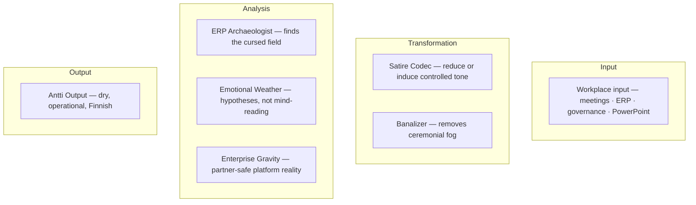
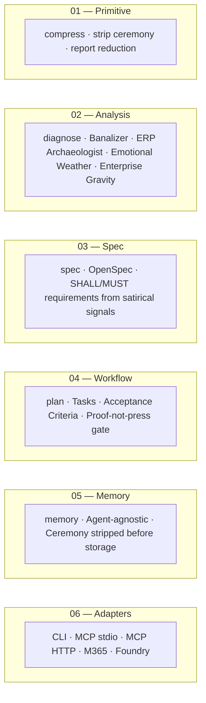

<div align="center">

#  Antti Stack(TM)

### The enterprise-grade absurdity layer for agent-native workplace survival.

**Fight the banality of worklife by making fun of all the absurdity.**

[](#)
[](.github/workflows/ci.yml)
[](CONTRIBUTING.md)
[](#)
[](#)
[](#)
[](#)

**Humans are smart. Employees are stupid.**  
This is not a contradiction. It is an operating model.

</div>

---

## What is Antti Stack?

Antti Stack is a deliberately over-engineered ecosystem for generating dry, Finnish, technically credible workplace absurdism.

It turns ordinary corporate material - ERP migrations, master data issues, Azure certifications, governance rituals, architecture diagrams, stakeholder alignment, and suspicious Excel files - into content that is still professionally usable, but no longer spiritually corrosive.

It is not a joke generator.

It is a **banality compression platform**.

Because enterprise work already contains the comedy.  
The stack merely indexes it.

---

## What is in the box

Antti Stack is a TypeScript CLI and MCP toolkit. No cloud service required. No hosting required. No transformation program required.

What is actually here:

| Component | File | What it does |
|-----------|------|-------------|
| CLI | `antti` | 10+ modes: diagnose, compress, plan, spec, meme, memory, codec |
| MCP stdio | `antti-mcp` | 14 tools for Claude Desktop, Claude Code, GitHub Copilot |
| MCP HTTP | `antti-mcp-http` | Same 14 tools over HTTP for ChatGPT and remote agents |
| Satire Codec | `src/codec.ts` | Bidirectional: reduce corporate fog to meaning, induce controlled tone |
| Token Austerity Office | `src/compress.ts` | Strips ceremony. Fewer tokens, same meaning. Reports what survived and what was removed. |
| Emotional Weather | `src/emotion.ts` | Business-emotion hypotheses. Never claims certainty. |
| Enterprise Gravity | `src/enterprise-gravity.ts` | Partner-safe Microsoft/ERP platform friction detection. |
| OpenSpec | `src/spec.ts` | Reads satirical signals. Produces SHALL/MUST/SHOULD requirements and Given/When/Then scenarios as a Markdown document. |
| Planner | `src/plan.ts` | Vague ask → tasks with testable acceptance criteria. |
| Memory | `src/memory.ts` | JSONL. Agent-agnostic. Strips ceremony before storage. |
| Meme engine | `src/meme.ts` | Signal → imgflip template. Optional URL generation. |
| M365 adapter | `adapters/m365/` | Declarative agent scaffold + validation. |
| Foundry adapter | `adapters/foundry/` | Agent Service scaffold + validation. |

The satire is the diagnostic instrument. The code is the delivery vehicle. Both are open source.

---

## Following modern software tradition, the project now has layers

The roadmap originally said "before anyone has asked for it." Several people have now asked for it. This section has been updated accordingly.

---

## What is implemented

These tools exist, are tested, and produce output.

| Tool | CLI / MCP | What it does |
|------|-----------|-------------|
| **Core agent** | `antti` | Generates dry, technically credible workplace absurdism across 10+ modes |
| **Satire Codec** | `antti codec` / `satirize` / `desatirize` | Reduces corporate fog to plain meaning. Induces controlled Antti tone without inventing facts. |
| **Banalizer** | `antti --mode banalizer` | Detects corporate overhype phrases and replaces them with plain language |
| **ERP Archaeologist** | `antti --mode archaeology` | Reads ERP signals from text. Finds the field no one documented since 2014. |
| **Token Austerity Office** | `antti compress` | Strips ceremony. Reports reduction. Flags meaning survival. |
| **Emotional Weather** | `antti emotional_weather` | Produces business-emotion hypotheses. Never claims certainty. |
| **Enterprise Gravity** | `antti enterprise_gravity` | Detects platform/process friction in a partner-safe way. |
| **OpenSpec** | `antti spec` | Reads satirical signals. Produces SHALL/MUST/SHOULD requirements as Markdown. |
| **Planner** | `antti plan` | Converts a vague ask into tasks with testable checks. |
| **Memory** | `antti memory` | Stores compressed, signal-indexed context. Agent-agnostic. |
| **Meme engine** | `antti meme` | Maps enterprise signals to imgflip templates. Optional URL. |
| **MCP server (stdio)** | `antti-mcp` | All 14 tools for Claude Desktop, Claude Code, GitHub Copilot |
| **MCP server (HTTP)** | `antti-mcp-http` | Same 14 tools over HTTP for ChatGPT and remote agents |

## What is not implemented

These appear in the original README concept list. They are not tools. They are modes, jokes, or roadmap items.

| Name | Status | Reality |
|------|--------|---------|
| Datapoint Relator | Mode, not a tool | `--mode romcom` covers some of this |
| Governance Theatre Engine | Mode | `--mode governance` exists |
| Master Data RomCom | Mode | `--mode romcom` exists |
| Certification Pokemon Layer | Not implemented | The badge economy awaits its archaeologist |

---

## Core Thesis

Work is not boring because humans are boring.

Work is boring because organizations take smart humans and process them through:

- approval chains
- operating models
- status meetings
- steering groups
- quarterly priorities
- role definitions
- governance forums
- transformation programs
- enterprise architecture principles
- spreadsheets called `final_final_v3.xlsx`

The output is an employee.

Antti Stack exists to reverse this damage using technical competence, pattern recognition, and dry mockery.

---

## Why Antti Stack?

Because the modern workplace has many problems:

### 01 - Corporate language is inflated
Everything is a journey, a transformation, a strategic enabler, or a capability uplift.

Antti Stack converts this into human-readable despair.

### 02 - ERP systems are archaeological sites
The truth is in there somewhere.

Usually split between four tables, one deprecated field, a supplier number convention from 2011, and a person called Markku who retired during the previous platform renewal. All standard fields are suspect and all custom fields are

### 03 - Master data is emotional
Duplicate vendors are not records.

They are unresolved relationships. And relationships are about power. Power over the last cupcake in the fridge.


### 04 - Architecture is theatre with boxes
The diagram is clean.

The implementation has three local exceptions, a legacy integration, and a batch job that only works during a full moon because of SAP time zones.

### 05 - Certifications have become Pokemon
One more badge and the career path will surely evolve.

---

## Installation

The package is on GitHub. npm publish is pending.

```bash
git clone https://github.com/epical-antti-syvanne/antti-stack
cd antti-stack
npm install
npm run build
npm link   # makes antti, antti-mcp, antti-mcp-http available globally
```

Once published to npm:

```bash
npm install -g antti-stack
```

This will work when it works. Until then, clone it. The code is real.

---

## Usage

```bash
antti "rewrite this LinkedIn post without sounding like a consulting brochure"
```

Output:

```text
I was asked to describe our transformation journey.

So far it appears to be three PowerPoints, one renamed SharePoint folder, and a Teams Team where hope goes to become searchable.

Still. Progress has been claimed.
```

---

## Agent Modes

### `post`
Generate LinkedIn posts that sound professional, but not infected.

```bash
antti post "Azure certification renewal"
```

```text
Renewed another Azure certification.

At this point the transcript is starting to look like someone tried to solve career development with Pokemon logic.

This is probably fine.
```

---

### `comment`
Write sharp, dry LinkedIn comments.

```bash
antti comment "full stack data developer debate"
```

```text
<sarkasmi>
Data engineers cannot talk to end users. This is why Data Analysts are inserted as a diplomatic layer.
</sarkasmi>

The real issue is not whether one person can understand the whole pipe.

The issue is that switching between SQL, DAX, Python, Azure DevOps, business definitions, and PowerPoint every two weeks turns the brain into lightly governed porridge.
```

---

### `romcom`
Turn master data into relationship drama.

```bash
antti romcom "supplier deduplication"
```

```text
Supplier deduplication is a romantic comedy.

Two records are clearly the same vendor, but one has a VAT number, the other has an address from 2017, and both are waiting for Business to realise they were meant to be together.

Excel conditional formatting plays the quirky best friend.
```

---

### `archaeology`
Find connections between esoteric ERP datapoints.

```bash
antti archaeology "why do these invoices map to the wrong supplier?"
```

```text
The invoices are not wrong.

They are historically correct in a way the current process no longer admits.

The supplier ID changed in 2018, the purchasing org mapping changed in 2021, and the integration still believes both events are gossip.

For reasons, this is now architecture.
```

---

### `banalizer`
Remove corporate overhype.

Input:

```text
We are thrilled to embark on a transformational journey to unlock data-driven value across the enterprise.
```

Output:

```text
We are trying to make the reports less wrong.

There will be meetings.
```

---

### `compress`
Stateless text transformation. Text in, compressed text out. Nothing is stored.

Strips ceremony phrases, reports what was removed, checks whether meaning survived. Use it when you want the plain version of a text without writing anything to disk.

```bash
antti compress "We are thrilled to announce a transformational journey to unlock value going forward."
```

```text
We are announcing a project.

Token Austerity Office report:
Original: 13 words. Compressed: 5 words. Reduction: 62%.
Ceremony removed: 4 pattern(s): going forward (direction theatre); unlock value (corporate fog); transformational journey (transformation fog); and more.
Meaning: survived compression.
Verdict: 62% removed. The original had significant ceremony.
```

---

### `memory` and `memory-add`
Persistent storage. Text in, compressed version written to `.antti/memory.jsonl`. Stays there. Retrievable later by search.

`memory-add` compresses the text first (same as `compress`), then stores the result with a category and signal tags. The stored version is the ceremony-stripped version, not the original. Secrets are scrubbed before write.

`memory` searches or lists what has been stored.

```bash
# Store a decision
antti memory-add --category decision_fossils "We decided to keep the Excel mapping until SAP go-live."

# Retrieve it later
antti memory "Excel mapping"

# List everything in a category
antti memory --category decision_fossils
```

**The difference from `compress`:** `compress` returns text to you. `memory-add` stores text for later. They both strip ceremony. One is a transformation, one is a write.

---

### `plan`
Convert a vague enterprise ask into tasks with acceptance criteria and testable checks.

```bash
antti plan "We need to align stakeholders before go-live because the SAP invoice mapping is still using final_final_v3.xlsx."
```

```text
Goal: We need to align stakeholders before go-live because the SAP invoice mapping is still using final_final_v3.xlsx.

Tasks:
1. [ ] Validate the current state of SAP final_final_v3.xlsx in the source ERP system.
   check: Query returns consistent, documented results from the named ERP system.

2. [ ] Migrate SAP final_final_v3.xlsx from the manual source to a governed system.
   check: The spreadsheet source can be deprecated; the governed system produces the same output.

3. [ ] Get explicit sign-off on SAP final_final_v3.xlsx from the relevant decision-makers.
   check: Sign-off is recorded in a ticket with approver name and date.

...

Proof-not-press: READY. All 7 tasks have testable checks.
```

---

## Architecture



Antti Stack is built as real tooling first and satire second.

Each tool works independently. The codec reduces styled corporate text into plain operational meaning, or induces controlled Antti-style satire back into the text. The planner generates tasks. The memory stores compressed context. None requires the others. This is useful because AI can create decent work products, but it cannot reliably read human emotions. Business still runs on emotions: trust, fear, status, fatigue, budget anxiety, and whether anyone wants to say yes in public.

So the stack treats emotions as hypotheses, platform friction as enterprise gravity, and jokes as a style layer with tests.

---

## Stack Layers

The stack is organized into independently useful layers. Each layer works alone. Combined layers compound.



| Layer | Command | What it does |
|-------|---------|--------------|
| 01 Primitive | `antti compress` | Strips ceremony. Reports reduction, what was removed, meme suggestion at ≥20% reduction. |
| 02 Analysis | `antti --mode diagnose` | Surfaces ERP signals, emotional weather hypotheses, enterprise gravity, meme anchor. |
| 03 Spec | `antti spec` | Produces an OpenSpec Markdown document. Requirements derived from satirical signals. |
| 04 Workflow | `antti plan` | Tasks with testable checks, acceptance criteria, proof-not-press gate. |
| 05 Memory | `antti memory` / MCP `memory_add` | Persistent storage. Text in, compressed version written to `.antti/memory.jsonl`. Searchable later. Not the same as `compress` — `compress` returns text, `memory-add` stores it. |
| 06 Adapters | MCP / M365 / Foundry | Same logic, 13 tools, different surface. |

### One way to use multiple tools together

Each tool works on its own. If you want to use several, here is one example of how they can be combined. No step requires the previous one.

```
Start anywhere.

[compress]    Give it corporate text. Get the plain meaning back.
[diagnose]    Give it workplace context. Get emotional weather and enterprise gravity signals.
[spec]        Give it a situation. Get SHALL/MUST/SHOULD requirements derived from those signals.
[plan]        Give it a goal. Get tasks with testable acceptance criteria.
[memory]      Give it any text. Ceremony is stripped before storage. Lean context is stored.
[meme]        Give it any input. Get an imgflip template that matches the absurdity level.
```

None of these require the others. A user who only needs `compress` does not need `spec`. An agent that only needs `memory_add` does not need to understand the satire codec. Each tool has its own input and its own output.

Satire is the primary conveyor of truth. The tools make it usable.

Fewer ceremonies, same work.

---

## MCP Client Setup

Two transports. Same 14 tools. Pick the one that fits your client.

### stdio — Claude Desktop, Claude Code, GitHub Copilot

The server runs as a local subprocess. No port. No hosting. Build first:

```bash
npm run build
```

**Claude Desktop** (`~/Library/Application Support/Claude/claude_desktop_config.json` on Mac, `%APPDATA%\Claude\claude_desktop_config.json` on Windows):

```json
{
  "mcpServers": {
    "antti-stack": {
      "command": "node",
      "args": ["/path/to/antti-stack/dist/mcp.js"]
    }
  }
}
```

**GitHub Copilot in VS Code** (`.vscode/mcp.json` in your workspace):

```json
{
  "servers": {
    "antti-stack": {
      "type": "stdio",
      "command": "node",
      "args": ["/path/to/antti-stack/dist/mcp.js"]
    }
  }
}
```

**Claude Code** (add via `/mcp` command or `claude mcp add`):

```bash
claude mcp add antti-stack node /path/to/antti-stack/dist/mcp.js
```

### HTTP — ChatGPT, remote agents, any HTTP MCP client

Start the HTTP server:

```bash
# Local only (default)
node dist/mcp-http.js

# Remote / team use
MCP_HTTP_HOST=0.0.0.0 MCP_HTTP_PORT=3000 node dist/mcp-http.js
```

MCP endpoint: `http://localhost:3000/mcp`

Configure your client with the endpoint URL. For ChatGPT or any agent that supports MCP over HTTP, point it at `http://your-host:3000/mcp`.

**Environment variables:**

| Variable | Default | Purpose |
|----------|---------|---------|
| `MCP_HTTP_PORT` | `3000` | Port to listen on |
| `MCP_HTTP_HOST` | `127.0.0.1` | Bind address. Set `0.0.0.0` for remote access. |
| `IMGFLIP_USERNAME` | — | imgflip API credential for `generate_meme` |
| `IMGFLIP_PASSWORD` | — | imgflip API credential for `generate_meme` |

---

## Vendor Gravity

Antti Stack does not hate your ERP system.

It recognizes that enterprise platforms are where work happens. They are also where enthusiasm goes to become a licensing invoice, a naming convention, and an admin portal that has not been updated since the vendor acquired another vendor and renamed the product twice.

Detected gravity patterns:

| Pattern | What it looks like | Operational note |
|---------|-------------------|------------------|
| Excel-as-production | `final_final_v3.xlsx` is the system of record | The data is accurate. The governance is absent. |
| Teams-channel governance | "We discussed it in the channel" | The decision exists. It is not findable. |
| SharePoint cosmology | Folders organized by quarter, department, and hope | The document exists. Only Markku knows the path. He is on holiday. |
| Power BI semantic dispute | Two definitions of "revenue" in one workspace | This is normal and will require a steering group. |
| Azure landing-zone theatre | The architecture slide is excellent | The environment still has contributor rights for `@temp_consultant_2022`. |
| Entra identity fog | Identity is clearly defined | There are 14 display-name variants and two tenant IDs. |
| Certification Pokemon | One more badge and the career will surely evolve | The career will not evolve. The badge is real. |
| Licensing weather | Current entitlements are explained in the agreement | They are explained in an agreement that references an amendment that references a predecessor agreement from 2019. |

These are recognized as platform gravity, not vendor malice. The platforms are neutral. The incentive model occasionally invoices you for features you enabled by accident during a tenant migration.

---

## Design Principles

### Spec > vibes
Unless the spec is just vibes in Confluence.

### Signal > ceremony
The meeting is not the work.

Unless the work is to schedule another meeting, in which case we have achieved recursive governance.

### Humans > employees
Humans are smart.

Employees are what happens after the third mandatory alignment session.

### ERP truth is real truth
The ERP knows what happened.

It may express this through a custom field named `ZZ_SUPP_REF_OLD2`, but the truth is there.

### Mock systems, not people
The target is not individuals.

The target is the machinery that turns adults into calendar-dependent compliance mammals.

---

## Comedy Runtime

Antti Stack draws from Finnish absurdist comedy traditions, especially:

- **Studio Julmahuvi**
- **Ihmebantu**

This means:

- deadpan escalation
- mock-bureaucratic seriousness
- institutional formats used incorrectly but confidently
- quiet characters trapped in ridiculous systems
- jokes that are not explained
- formal language applied to deeply stupid situations

The workplace is treated like a sketch show that accidentally received a budget, an ERP system, and a steering group.

---

## Example Outputs

### Governance

```text
The governance model is now clear.

Decisions are made in the forum that does not have mandate, escalated to the forum that does not have context, and documented in the place no one can find.

This is called transparency.
```

### Architecture

```text
Architecture is what happens when the organization wants alignment but everyone still needs their own local exception.

So you draw the beautiful boxes.

Then reality arrives with three integrations, a procurement process, and a country-specific requirement last updated in 2009.
```

### ERP

```text
The nice thing about esoteric ERP systems is that they always contain the truth.

Unfortunately it is usually split between four tables, one deprecated field, a supplier number convention from 2011, and someone's heroic Excel file.

Still. Connections can be found.
```

### Data Platform

```text
We built a modern data platform.

It ingests data from legacy systems, applies governance, enables self-service analytics, and eventually produces the same Excel attachment as before, but with better lineage.

Progress.
```

### Transformation

```text
The transformation journey continues.

Today we renamed the workstream, moved the files to a new Teams folder, and discovered that the critical dependency is still a person called Jari.

He is on holiday.
```

---

## Anti-Patterns

Do not generate:

```text
I'm thrilled to announce...
```

Unless the next sentence is:

```text
...that the steering group has approved the formation of a subcommittee to evaluate whether we are aligned enough to begin discovery.
```

Avoid:

- data is the new oil
- unlocking business value
- transformational journey
- seamless integration
- single source of truth
- AI-powered synergy
- low-hanging fruit
- strategic enabler
- digital acceleration
- center of excellence, unless written as `Osaamiskeskus(TM)`

---

## Roadmap

### v0.1 - The Agent
- [x] Dry workplace absurdity
- [x] ERP suspicion
- [x] Master data romantic comedy
- [x] Anti-LinkedIn-influencer filter
- [x] Finnish deadpan runtime

### v0.2 - Banalizer and Codec
- [x] Detect corporate overhype
- [x] Replace "unlock value" with actual work
- [x] Satire Codec: reduce (remove ceremony) and induce (add controlled tone)
- [x] `antti compress`: Token Austerity Office — strip ceremony, report reduction
- [x] Round-trip fixtures: corporate fog → plain meaning → partner-safe satire

### v0.3 - ERP and Emotional Stack
- [x] Identify undocumented fields
- [x] Infer process history from broken mappings
- [x] Emotional Weather: business-emotion hypotheses, not emotional facts
- [x] Enterprise Gravity: partner-safe Microsoft platform friction detection
- [x] Detect Excel-as-production, Teams governance, SharePoint sprawl, Power BI disputes, Azure theatre

### v0.4 - Memory and Planning
- [x] Local JSONL memory: add, search, list, secret scrubbing
- [x] `antti plan`: spec → tasks → acceptance criteria with proof-not-press gate
- [ ] Memory categories: corporate fog, enterprise gravity, decision fossils
- [ ] `antti compress` integrated into memory pipeline

### v0.5 - Platform Adapters
- [x] MCP stdio server: 14 tools — Claude Desktop, Claude Code, GitHub Copilot
- [x] MCP HTTP server: same 14 tools — ChatGPT, remote agents, any HTTP MCP client
- [x] M365 Copilot declarative agent scaffold and validation
- [x] Foundry Agent Service scaffold and validation
- [ ] VS Code extension wiring

### v1.0 - Antti Stack Ecosystem
- JSONL memory is final. Zero dependency, human-readable, portable.
- [ ] Evaluation corpus: golden examples, forbidden phrase regression
- [ ] GitHub issue/PR Finnish trivia gate
- [ ] Cloud dashboard (only if reality becomes unavoidable)

---

## Acknowledgements

### Caveman

The architecture of this stack was inspired by Caveman.

Caveman established the architectural pattern this project follows: compression as a primitive, spec before execution, persistent memory for what the organization keeps forgetting, and proof artifacts instead of confident announcements.

Caveman calls it "fewer words, same work."

Antti Stack calls it "fewer ceremonies, same work."

The difference is mostly the meeting count.

All the comedy in this stack celebrates what Caveman is: a serious attempt to make AI work leaner, more honest, and more auditable than the default. The satire targets the enterprise machinery that makes Caveman necessary. It does not target Caveman.

Caveman is the one competent adult in the architecture diagram.

---

## Open Source Ceremonies

Antti Stack has adopted the useful open-source rituals that actually exist:

- [MIT License](LICENSE) — copyright Antti Syvänne
- [Third-party notices](NOTICE) — BSD and ISC dependency attributions
- [Contributing guide](CONTRIBUTING.md) — how to contribute without becoming a brochure
- Finnish trivia human-check gate (planned, Phase 9) — reduces enterprise cargo-culting from external contributors

The following rituals have been deferred until they are needed:

- Code of conduct (the contributing guide covers it)
- Security policy (write to the author)
- Changelog (the git log is the changelog; the roadmap section is the summary)
- Dependabot (noted; not yet configured)
- Workshop scheduling (permanently deferred)

This is not bureaucracy.

It is bureaucracy with acceptance criteria and an honest Deferred section.

---

## Frequently Avoided Questions

### Is this serious?

Unfortunately, yes.

### Is this satire?

Also yes.

### Can it create actual useful content?

Yes.

That is part of the problem.

### Why an ecosystem?

Because a single useful thing is not enough anymore.

It must become a platform, then a stack, then an ecosystem, then a governance concern.

### Is this enterprise-ready?

It contains a roadmap, architecture diagram, badges, and the word ecosystem.

So yes.

---

## License

MIT. Copyright (c) 2026 Antti Syvänne.

My personality is mine but it can be used to improve the world.

Third-party component notices: see [NOTICE](NOTICE).

Also:

```text
Do whatever you want, but please do not schedule a workshop about it.
```

---

<div align="center">

## Fewer ceremonies. Same despair.

**Antti Stack(TM)**  
Enterprise absurdity, compressed into usable output.

</div>

---

## Local Development

Clone the repository and run the CLI locally:

```bash
npm install
npm run dev -- --mode banalizer "We are thrilled to unlock data-driven value"
npm run dev -- --mode romcom "supplier deduplication"
npm run dev -- --mode archaeology "wrong supplier mapping"
```

Build:

```bash
npm run build
node dist/cli.js --mode governance "decision rights"
```

The stack is intentionally small at first.
This is only to make the future ecosystem expansion more embarrassing.

## Current CLI Surface

```bash
# Text generation modes
antti "rewrite this LinkedIn post"                         # default: post mode
antti --mode diagnose "legacy Oracle invoice mapping"      # full diagnostic
antti --mode banalizer "unlock data-driven value"          # corporate fog removal
antti --mode governance "decision rights"                  # governance theatre output
antti --mode archaeology "wrong supplier mapping"          # ERP signal analysis
antti --mode meme "SAP invoice mapping uses Excel"         # mode-only, template text only

# Subcommands
antti compress "going forward we will leverage synergies"  # Token Austerity Office
antti spec "SAP invoice mapping uses Excel, nobody owns it"  # OpenSpec: satire → SHALL/MUST requirements
antti plan "align stakeholders before go-live, SAP still uses final_final.xlsx"
antti meme "power bi semantic dispute" --no-url            # template + optional URL
antti memory "power bi"                                    # search memory
antti memory --category enterprise_gravity                 # filter by category
antti memory-add --category decision_fossils "decision text"  # add manual note
antti schema                                               # emit AgentResponse JSON schema

# Useful flags for main command
# --json         full structured AgentResponse for automation
# --analyze      print banalizer + ERP + relations + governance before output
# --safe         reduce sarcasm for professional contexts
# --more-edge    increase absurdity without attacking people
# --remember     store response in local memory (.antti/memory.jsonl)
```

Memory categories: `corporate_fog` | `enterprise_gravity` | `emotional_weather` | `erp_archaeology` | `decision_fossils` | `satire_fixtures` | `reviewer_notes` | `general`

Set `IMGFLIP_USERNAME` and `IMGFLIP_PASSWORD` env vars (see `.env.example`) to generate real meme URLs via `antti meme`.
